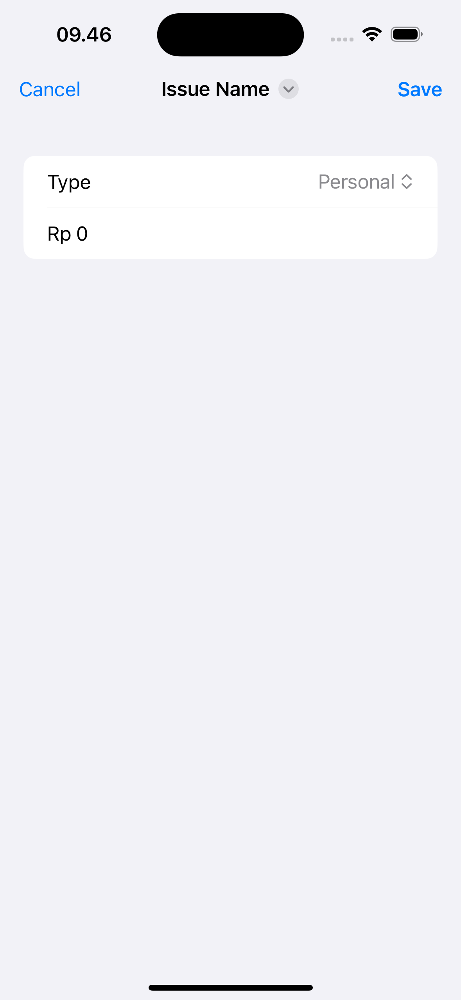
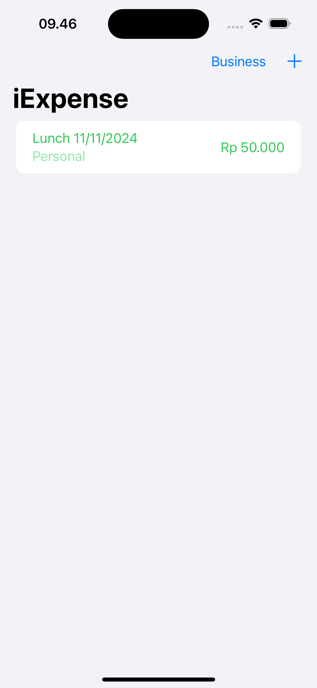
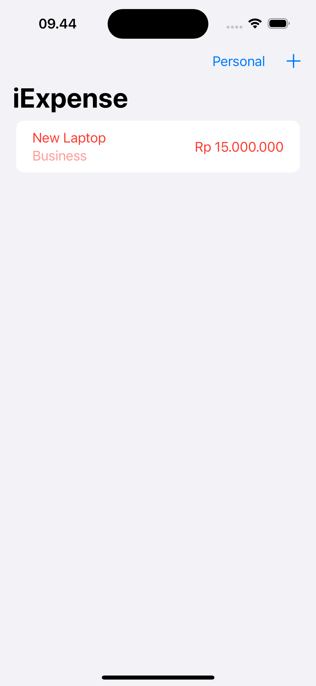

# iExpense
This is a basic learning project to track expense that separates personal costs from business costs. – you see list of business or personal expense, you can change between business or personal expense and add new expense by tap button on toolbar.

---
The source learning is from 7th project of course "100 Days of SwiftUI" (https://www.hackingwithswift.com/100/swiftui)

---
## Goals
1. Display a list of expenses categorized as either business or personal.
2. Provide a toggle to switch between viewing business or personal expenses.
3. Enable users to add new expenses using a button on the toolbar.
4. Allow users to input expense details such as amount, category (business or personal), and a brief description.
5. Ensure the interface updates dynamically to reflect changes in the expense list.

# iExpense – Image Comments Feature

---

